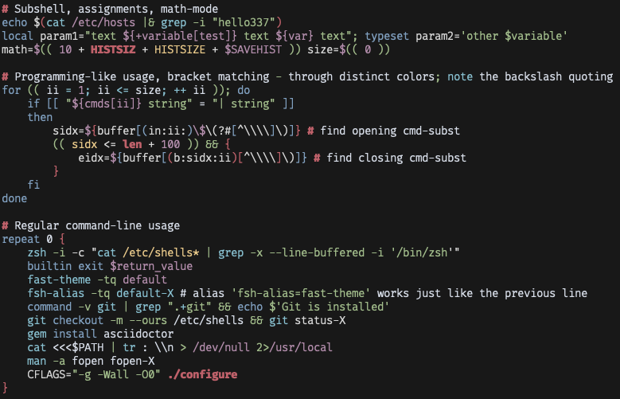

# nord-zsh-fsh

An arctic, north-bluish clean and elegant theme for [fast-syntax-highlighting](https://github.com/zdharma-continuum/fast-syntax-highlighting)

Design based on the [Nord](https://github.com/arcticicestudio/nord) color palette.

(I do not know why the comments are not rendered correctly)

## Install

1. Download the `nord.ini` file
2. Move the file to `~/.config/fsh/`
3. Activate the theme with `fast-theme XDG:nord`

## License

MIT © C8H9NO2-1
